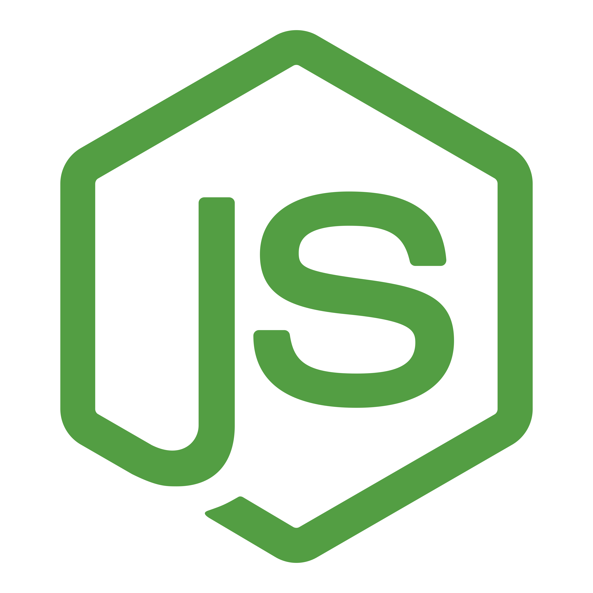

<h1 align='center'>
 Full Stack Developer 
</h1>

 Hola! Mi nombre es Juan Manuel Carreras. Luego de estudiar programación de manera autodidacta decidí desafiarme en un Bootcamp. Actualmente me encuentro certificado como <strong>Full Stack Developer</strong> en el bootcamp de HENRY, acá tuve la experiencia participar en proyectos reales tanto individualmente como proyectos grupales.

Estoy ansioso de comenzar mi etapa laboral, abierto a nuevos desafíos y sumarme a un equipo de trabajo en el que pueda seguir capacitándome y perfeccionando mis habilidades técnicas.

<h2>Habilidades</h2>

entre otras

<strong>Actualmente familiarizándome con ...</strong>

<h2>Mis Proyectos</h2>
 
 
<strong>Proyecto Final</strong>  
    Diseñar y desarrollar un E-Commerce de Libros que incluía: búsquedas, filtrados, ordenamientos, creación, autenticaciones de usuarios, pasarela de pagos, chatbot, reviews, dashboard, productos destacados.

<a href='https://github.com/scch94/probando-pf'><strong>Henry Books</strong></a>

<strong>Proyecto Individual</strong>  
El objetivo de este proyecto es hacer una App usando React, Redux, NodeJS, Sequelize y Express.
 - Desarrollando y gestionando servidores con (Express y NodeJs) Base de Datos con ( Postgres SQL y Sequelize) 
- Desarrollando y gestionando la parte del cliente con (ReactJs, Redux, HTML y CSS)
 React y sus estados locales / coompnentes y sus siclos de vida
 Redux y sus estados globales

<a href='https://github.com/JuanMaCarreras/PI-Countries'><strong>Countries</strong></a>

<h2>No dudes en contactarme!</h2>

Correo: manuucarreras@gmail.com

+54 351-3467425 - WhatsApp 

<a href='https://www.linkedin.com/in/manuel-carreras/'>Linkedin</a>
